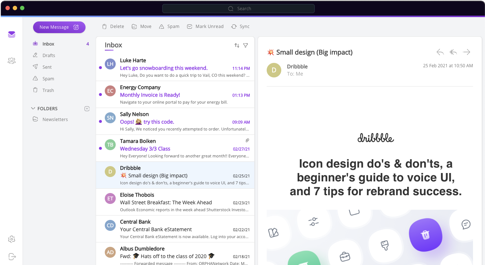

# Telios Desktop Email Client

[](https://gitlab.com/telios2/client-desktop/commits/beta)

<br>

Telios is an offline-capabale e2e encrypted email service built on [hypercore-protocol](https://hypercore-protocol.org/) for sending and receiving emails.

<br>




## Starting Development

Start the app in `dev` mode:

```bash
yarn dev
```

Start the app in `prod` mode:

```bash
yarn start
```

## Packaging for Production

To package apps for the local platform:

```bash
yarn package
```

## Docs

See our [docs here](https://docs.telios.io)

## License

CC-BY-NC-4.0
